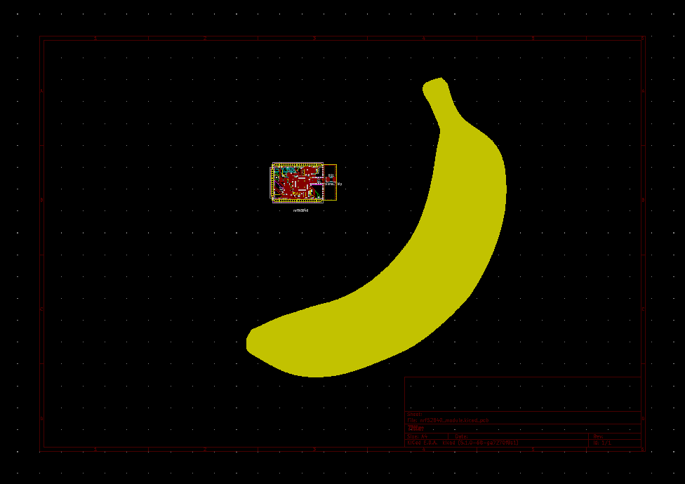
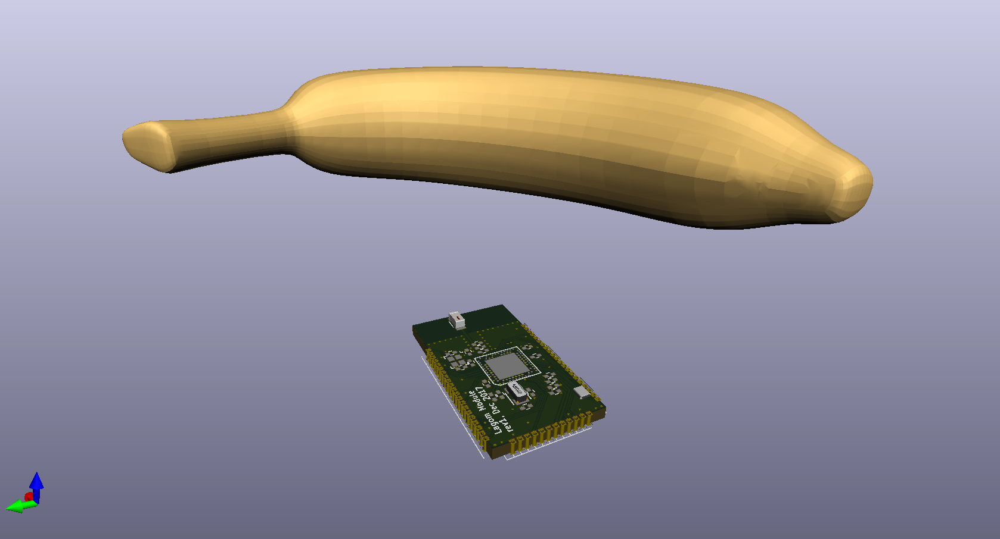

# KiCad Banana footprint - for scale!

Have you ever thought your PCB was huge cause you've been working on it zoomed in a lot, just to receive it and realize it's tiny?

Well, worry no more cause now there is a solution for that, the KiCad Banana footprint!

Just place the Banana in your design and you will immediately know the scale of you PCB!

But wait, there's more! Not only you can see the banana in the 2D design, you can also see it in 3D!

[Banana Vector by vecteezy.com](https://www.vecteezy.com)

[Banan Model by www.turbosquid.com](https://www.turbosquid.com/)